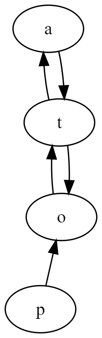
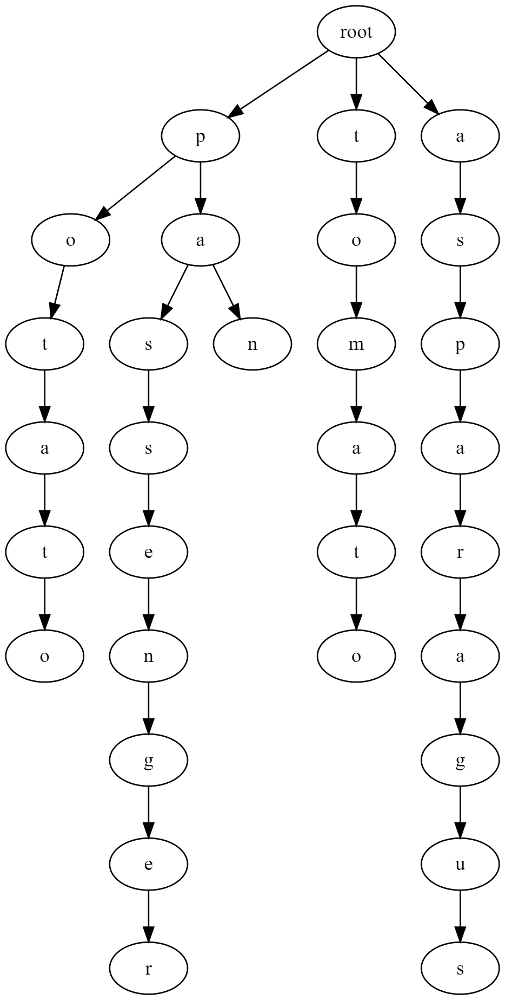
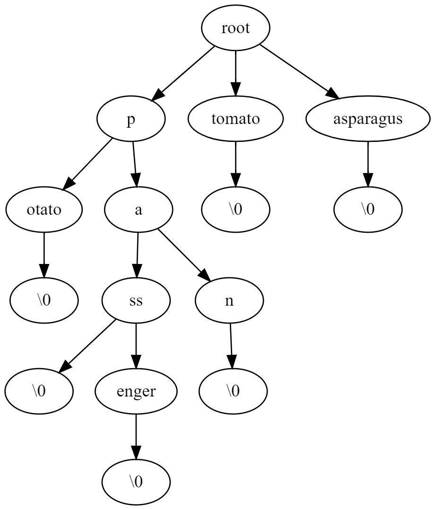

Trie
===

"Theory"
---

You already know about trees - we saw a few types of binary trees, namely BST and Heaps. However, there are a lot more trees out there - with a lot of wonky rules.

One of those trees is called a **`Trie`**, and while the exact etymology isn't clear, the best explanation I've seen is that it stands for re**trie**val tree (more on that below). It is very much a **tree** (has the concept of parent and child nodes), however, it is very much **not binary**. In fact, a Trie can have any number of children - we will be using an `std::set` to manage them, instead of `left`/`right` like we did with binary search trees. Why a `set` and not a `vector`? You'll find out shortly.

So what is a `Trie` used for? In short - string searching. There are two main types of tries, a **prefix trie** (more common and what you'll be working on) and a **suffix trie**. Let's look at a motivating example to see why we might need a prefix trie. Imagine we have the following set of words:
```
potato
passenger
tomato
pan
pass
asparagus
```
How do we **efficiently** do an auto-completion on this set, such that typing a prefix gives us an alphabetical list of suggestions, like so:
```
> pa
pan
pass
passenger
```
Consider this - what if we built a tree where the parent-child relationship was **word adjacency**? i.e. node `a` is a child of node `b` if and only if the value of `b` can be found directly after the value of `a` in one of the words in our corpus? So, to give some examples, because `potato` is in our list, we'd like the following set of parent/child pairs:
* `p` is parent of `o`
* `o` is parent of `t`
* `t` is parent of `a`
* `a` is parent of `t`
* `t` is parent of `o`

Now we see why throwing things in an `std::set` was useful - at each step, we can check if the node exists in our set of children, and only create it if it doesn't. Following just this first rule, the resulting "tree" would be:



Uh oh... that's not a tree, is it? That's a graph. So we need another rule! We will introduce a **mandatory** root node, which indicates string start. Then, all children of the root node must be characters that words start with. Each child of those children will be possible **second** characters in a word, etc. In other words, parent-child relationship is still **word adjacency** but now we are saying the node depth **must** match the position in a word in our corpus. Essentially, we want to split the `t` at position #3 of `potato` from the `t` at position #5 and treat them as separate nodes. With that second rule in hand - let's look at our tree for the corpus of words above:



(btw, you can see the graphviz code for this [here](https://dreampuf.github.io/GraphvizOnline/#digraph%20G%20%7B%0A%20%20%20%20root%5Blabel%3D%22root%22%5D%0A%20%20%20%20%2F%2F%20potato%0A%20%20%20%20p1%5Blabel%3D%22p%22%5D%0A%20%20%20%20o1%5Blabel%3D%22o%22%5D%0A%20%20%20%20t1%5Blabel%3D%22t%22%5D%0A%20%20%20%20a1%5Blabel%3D%22a%22%5D%0A%20%20%20%20t2%5Blabel%3D%22t%22%5D%0A%20%20%20%20o2%5Blabel%3D%22o%22%5D%0A%20%20%20%20%0A%20%20%20%20%2F%2F%20passenger%0A%20%20%20%20a2%5Blabel%3D%22a%22%5D%0A%20%20%20%20s1%5Blabel%3D%22s%22%5D%0A%20%20%20%20s2%5Blabel%3D%22s%22%5D%0A%20%20%20%20e1%5Blabel%3D%22e%22%5D%0A%20%20%20%20n1%5Blabel%3D%22n%22%5D%0A%20%20%20%20g1%5Blabel%3D%22g%22%5D%0A%20%20%20%20e2%5Blabel%3D%22e%22%5D%0A%20%20%20%20r1%5Blabel%3D%22r%22%5D%0A%20%20%20%20%0A%20%20%20%20%2F%2F%20tomato%0A%20%20%20%20t3%5Blabel%3D%22t%22%5D%0A%20%20%20%20o3%5Blabel%3D%22o%22%5D%0A%20%20%20%20m1%5Blabel%3D%22m%22%5D%0A%20%20%20%20a3%5Blabel%3D%22a%22%5D%0A%20%20%20%20t4%5Blabel%3D%22t%22%5D%0A%20%20%20%20o4%5Blabel%3D%22o%22%5D%0A%20%20%20%20%0A%20%20%20%20%2F%2F%20pan%0A%20%20%20%20n2%5Blabel%3D%22n%22%5D%0A%20%20%20%20%0A%20%20%20%20%2F%2F%20asparagus%0A%20%20%20%20a5%5Blabel%3D%22a%22%5D%0A%20%20%20%20s3%5Blabel%3D%22s%22%5D%0A%20%20%20%20p2%5Blabel%3D%22p%22%5D%0A%20%20%20%20a6%5Blabel%3D%22a%22%5D%0A%20%20%20%20r2%5Blabel%3D%22r%22%5D%0A%20%20%20%20a7%5Blabel%3D%22a%22%5D%0A%20%20%20%20g2%5Blabel%3D%22g%22%5D%0A%20%20%20%20u1%5Blabel%3D%22u%22%5D%0A%20%20%20%20s4%5Blabel%3D%22s%22%5D%0A%20%20%20%20%0A%20%20%20%20%0A%20%20%20%20%2F%2F%20edges%0A%20%20%20%20root-%3Ep1-%3Eo1-%3Et1-%3Ea1-%3Et2-%3Eo2%0A%20%20%20%20p1-%3Ea2-%3Es1-%3Es2-%3Ee1-%3En1-%3Eg1-%3Ee2-%3Er1%0A%20%20%20%20root-%3Et3-%3Eo3-%3Em1-%3Ea3-%3Et4-%3Eo4%0A%20%20%20%20a2-%3En2%0A%20%20%20%20root-%3Ea5-%3Es3-%3Ep2-%3Ea6-%3Er2-%3Ea7-%3Eg2-%3Eu1-%3Es4%0A%7D) )

OK... definitely getting closer! This looks good, we can make one of these for any set of words. **However** - you may spot an issue on the search side. We haven't defined how we'd search one of these trees. Say we want to find all words that start with `pa` - we can follow `root`->`p`->`a` and then what? We can follow all children until we get to a leaf node - that would find `passenger` and `pan`. But what about `pass`? We now get to the final structural rule of a prefix trie - **all words have a terminator node** - this is just a special node that doesn't store a character but just says "hey my parent is the last character of a word". Let's look at this new tree.



(graphviz for this one [here](https://dreampuf.github.io/GraphvizOnline/#digraph%20G%20%7B%0A%20%20%20%20root%5Blabel%3D%22root%22%5D%0A%20%20%20%20%2F%2F%20potato%0A%20%20%20%20p1%5Blabel%3D%22p%22%5D%0A%20%20%20%20o1%5Blabel%3D%22otato%22%5D%0A%20%20%20%20end1%5Blabel%3D%22%5C%5C0%22%5D%0A%20%20%20%20%0A%20%20%20%20%2F%2F%20pass%20%2F%20passenger%0A%20%20%20%20a1%5Blabel%3D%22a%22%5D%0A%20%20%20%20s1%5Blabel%3D%22ss%22%5D%0A%20%20%20%20end2%5Blabel%3D%22%5C%5C0%22%5D%0A%20%20%20%20e1%5Blabel%3D%22enger%22%5D%0A%20%20%20%20end3%5Blabel%3D%22%5C%5C0%22%5D%0A%20%20%20%20%0A%20%20%20%20%2F%2F%20tomato%0A%20%20%20%20t1%5Blabel%3D%22tomato%22%5D%0A%20%20%20%20end4%5Blabel%3D%22%5C%5C0%22%5D%0A%20%20%20%20%0A%20%20%20%20%2F%2F%20pan%0A%20%20%20%20n1%5Blabel%3D%22n%22%5D%0A%20%20%20%20end5%5Blabel%3D%22%5C%5C0%22%5D%0A%20%20%20%20%0A%20%20%20%20%2F%2F%20asparagus%0A%20%20%20%20a2%5Blabel%3D%22asparagus%22%5D%0A%20%20%20%20end6%5Blabel%3D%22%5C%5C0%22%5D%0A%20%20%20%20%0A%20%20%20%20%0A%20%20%20%20%2F%2F%20edges%0A%20%20%20%20root-%3Ep1-%3Eo1-%3Eend1%0A%20%20%20%20p1-%3Ea1-%3Es1-%3Ee1-%3Eend3%0A%20%20%20%20s1-%3Eend2%0A%20%20%20%20root-%3Et1-%3Eend4%0A%20%20%20%20a1-%3En1-%3Eend5%0A%20%20%20%20root-%3Ea2-%3Eend6%0A%7D) )

We've done a small rendering change here - we collate all single-child nodes into a single bubble in our graph, e.g. `otato` - the trie will still contain individual nodes - this is just to make things a bit more clear in display. The `Trie::to_string` method in your assignment does the same collation - again - **this is just a display convenience**, all the individual nodes are still in the tree.

That aside - we can now see that we can look out for the special "end of string" markers in our tree and produce a word every time we see one. And - bonus points - because we chose an `std::set` to store children edges, they will be ordered alphabetically at each level for us automatically (`std::set` is a BST)! So, our end result will be alpha-sorted words that match a prefix - wonderful.

In this section, we've constructed each of the properties of a `trie` data structure and why it is needed. Feel free to come back to this during implementation if it gets confusing.

Assignment
---

Imagine you just started at a new company as an engineer. Your "job" is to finish the implementation of a prefix trie our intern started but couldn't finish. They left out the most crucial methods, `_insert` to put words into it, and `_find_with_prefix` to find matches. Everything else is fully functional and correct. **You only need to modify those two methods.**

This is a good opportunity for you to see what it's like to work in a "larger" codebase - even though this is still absolutely **miniscule** compared to anything in a real job. I've held nothing back - the code that exists makes extensive use of advanced C++ concepts - smart pointers, SFINAE, comparator overloading, precompiler directives, etc. There will be a lot of new concepts and code you don't understand but **abstraction is your friend**. Focus on the task at hand, and learn the bare minimum to execute. Then - if you have time, venture out into the code and learn something new.

***If you are diligent about it, you do not need to understand a single one of the C++ concepts we haven't talked about before - they are just noise.***

Algorithm Help
---

`_insert`

This will recursively add a word to the trie. Reference implementation is ~15 lines. General gist is:

* split the given prefix into two parts:
  * `current` - the first character of the prefix
  * `next` - the remaining characters of the prefix (hint: [`string::substr`](https://www.cplusplus.com/reference/string/string/substr/))
* find the child of the given node with value == `current`
  * if it does not exist - create it and add to the given node's children
* `_insert` with the child node you found (or just added) and `next`
* if `next` is empty, you can do one of two things:
  * stop here and add terminator node with `"\0"` to the node you just added
  * recurse one more level and add a stop condition in the beginning of your `_insert`

Example call sequence:

```
_insert_(root,"potato")
=>_insert_(p,"otato")
  =>_insert_(o,"tato")
    =>_insert_(t,"ato")
      =>_insert_(a,"to")
        =>_insert_(t,"o")
          [=>_insert_(o,"")] // Optional - see above.
```
(`=>` means recursive call)

`_find_with_prefix`

This is a recursive function that will find all words with prefix. Reference implementation is ~15 lines. The general gist of the function is:

* [stop condition below]
* split the given prefix into two parts:
  * `current` - the first character of the prefix
  * `next` - the remaining characters of the prefix (hint: [`string::substr`](https://www.cplusplus.com/reference/string/string/substr/))
* find the child of the given node with value == `current`
* if it does not exist - return empty
* otherwise `_find_with_prefix` on child node with `next` (remaining prefix)
  * prepend `current` to all results returned from this recursive call
* return prefixed words

Your stop condition for recursion can be a few things, but probably `prefix` being empty is the easiest. That means you are at the node where the prefix terminates so you can return all words from that point on - i.e. you can just call `_get_all_after_node` which is written for you :)

Example call sequence:

```
_find_with_prefix(root,"pas")
=>_find_with_prefix(p,"as")
  =>_find_with_prefix(a,"s")
    =>_find_with_prefix(s,"")
      =>_get_all_after_node(s)
      < {"s", "senger"}
    < {"ss", "ssenger"}
  < {"ass", "assenger"}
< {"pass", "passenger"}
```
(`=>` means recursive call, `<` means return value)

Testing / Grading
---

Luckily, the intern wrote all the tests just before they left - good thing they had good unit testing practices in mind and wrote the tests before the code. **You will be graded on exact # of tests passed, just like other assignments before.** You also have an interactive utility written in main I encourage you to explore. You can change the `MODE` const at the top of main to either load a dictionary from files, or provide your own interactively in the command line.